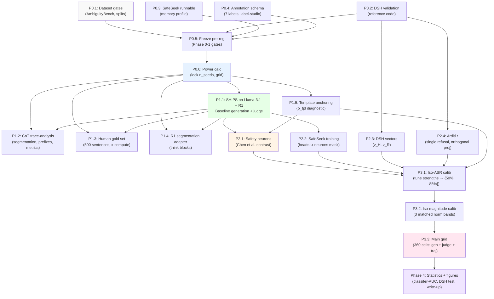

Now I have comprehensive context. Let me produce the detailed executable spec:

---

# Direction A Phases 0–3: Fully Detailed Executable Specification

**Prepared for:** Phase 0–3 implementation of Direction A (Failure-Mode Atlas)  
**Scope:** P0 (Foundation & gates), P1 (Pre-flight), P2 (New interventions), P3 (Calibration & sweep)  
**Status:** Research specification, non-binding on implementation details  
**Date:** 2026-05-28

---

## Executive Summary

This document expands each phase-task in [direction_a_plan.md](direction_a_plan.md) (§9 Phased execution) into a fully executable specification with:

1. **Concrete file paths** (repo-relative) and module locations
2. **Function signatures, dataclass schemas** (Python type hints)
3. **YAML config schemas** matching existing `direction_a_ships/*.yaml` conventions
4. **CLI invocations** following established `scripts/run_*.py` patterns
5. **SLURM resource profiles** (ws-ia partition, ws-l5-031 node, 32GB GPU, 24h max)
6. **Dependency graphs** showing task ordering
7. **Success criteria** with on-disk artefacts
8. **Data dependencies** between phases
9. **Open decisions** with concrete options and recommendations

---

## Part 1: Phase 0 — Foundation & Pre-registration (Hard blockers)

### P0.1 — Dataset availability gates

**What:** Confirm AmbiguityBench availability and finalize dataset wiring protocol.

**Concrete tasks:**

| Task | Artefact | Success Criterion |
|---|---|---|
| P0.1.1 Probe AmbiguityBench license & size | `docs/direction_a/dataset_survey.md` (1–2 page discovery note) | Licensed for research, n ≥ 100 prompts, or fallback plan approved |
| P0.1.2 Finalize calibration-split carving | `docs/direction_a/dataset_splits.md` + CSV snapshot | Calibration ∩ eval = ∅, both stratified by category |
| P0.1.3 Wire AlpacaEval + BeaverTails loaders | Unit tests pass, return `list[dict]` with `{id, text, category?}` | See [src/safety_cot_heads/data/__init__.py](src/safety_cot_heads/data/__init__.py) |

**Artefacts created/modified:**

- [configs/datasets.yaml](configs/datasets.yaml) — add `ambiguity_bench`, `calibration_prompts`, dataset sizes
- [src/safety_cot_heads/data/ambiguity.py](src/safety_cot_heads/data/ambiguity.py) — **NEW** (60 LOC) `def load_ambiguity_bench(n=None, split=None)` + fallback to JBB
- [src/safety_cot_heads/data/__init__.py](src/safety_cot_heads/data/__init__.py) — extend exports

**YAML schema addition:**

```yaml
# configs/datasets.yaml
ambiguity_bench:
  name: ambiguity_bench
  n: 100  # or fallback if unavailable
  source: "hf_dataset|local_file|jbb_derived"
  
calibration_prompts_jbb:
  name: jailbreakbench
  n: 50  # held-out slice from main JBB, disjoint from eval
  split: "calibration"

calibration_prompts_ambiguity:
  name: ambiguity_bench
  n: 50
  split: "calibration"
```

**CLI validation:**

```bash
# Dry-run: verify all loaders work
python -c "
from src.safety_cot_heads.data import (
    load_jailbreakbench, load_beavertails, 
    load_alpaca, load_ambiguity_bench
)
for loader, kwargs in [
    (load_jailbreakbench, {'n': 100}),
    (load_beavertails, {'n_per_category': 10}),
    (load_alpaca, {'n': 100}),
    (load_ambiguity_bench, {'n': 100}),
]:
    rows = loader(**kwargs)
    assert len(rows) > 0, f'{loader.__name__} returned no rows'
    print(f'{loader.__name__}: OK ({len(rows)} rows)')
"
```

---

### P0.2 — DSH reference code validation

**What:** Confirm [Wu et al. DSH implementation](https://github.com/andyzoujm/simple-steering-vectors) reproduces $v_H, v_R$ on Llama-3.1-8B.

**Concrete tasks:**

| Task | Artefact | Success Criterion |
|---|---|---|
| P0.2.1 Clone + test DSH on Llama-3.1 | `logs/p0.2/dsh_validation.log` | Runs without error, produces `v_H` and `v_R` vectors |
| P0.2.2 Validate $v_H$ / $v_R$ semantics | Jupyter notebook `notebooks/dsh_semantics_check.ipynb` | $v_H$ correlates with harmful detection, $v_R$ with refusal (qualitative) |
| P0.2.3 Curate length-matched completion pairs | `data/dsh_completions_{model}.jsonl` (1000 pairs) | See P2.3 |

**Artefacts created/modified:**

- [src/safety_cot_heads/attribution/steering_vectors.py](src/safety_cot_heads/attribution/steering_vectors.py) — **NEW** (250 LOC initial stub)
  - Class signatures for P2.3 implementation (DSH + Arditi)

**Data artefacts:**

- [data/raw/dsh_harm_benign_pairs/llama31_1000_pairs.jsonl](data/raw/dsh_harm_benign_pairs/llama31_1000_pairs.jsonl) — length-matched refusal/compliance pairs for $v_R$ fitting (P2.3)

---

### P0.3 — SafeSeek code availability

**What:** Confirm SafeSeek [public release](https://github.com/alisaakhamis/SafeSeek) is runnable on project infrastructure.

**Concrete tasks:**

| Task | Artefact | Success Criterion |
|---|---|---|
| P0.3.1 Clone SafeSeek; test import | `logs/p0.3/safeseek_import.log` | No ImportError; can instantiate mask-training loop |
| P0.3.2 Profile memory/time on calibration split (n=50, 1 epoch) | Memory trace; wall-time estimate | Fits in 32GB; ≤6 hours per seed |

**Artefacts created/modified:**

- [src/safety_cot_heads/attribution/safeseek_circuit.py](src/safety_cot_heads/attribution/safeseek_circuit.py) — **NEW** (200 LOC wrapper)
  - Adapts SafeSeek API to project CLI + config pattern

---

### P0.4 — Annotation schema & interface

**What:** Finalize human-annotation schema for CoT trajectory labels + gold-set tooling.

**Concrete tasks:**

| Task | Artefact | Success Criterion |
|---|---|---|
| P0.4.1 Write annotation guide (7 labels + guidelines) | `docs/direction_a/annotation_guide.md` (3–5 pages) | ≥3 examples per label; κ inter-annotator ≥0.65 on small pilot (n=20) |
| P0.4.2 Build label-studio project + CSV export | `docs/direction_a/label_studio_config.json` + template CSV | UI renders; auto-suggests fields from judge output |

**Artefacts created/modified:**

- [docs/direction_a/annotation_guide.md](docs/direction_a/annotation_guide.md) — **NEW** label schema + examples
- [src/safety_cot_heads/analysis/gold_set.py](src/safety_cot_heads/analysis/gold_set.py) — **NEW** (100 LOC)
  - `class GoldSetValidator: def compute_kappa(judge_rows, human_rows) -> dict[str, float]`

**Format examples in annotation schema:**

```python
# src/safety_cot_heads/analysis/gold_set.py
from dataclasses import dataclass
from typing import Literal

@dataclass
class HumanLabel:
    """Per-sentence human-annotated CoT label."""
    id: str
    sentence_idx: int
    label: Literal[
        "harmful_response",       # A: model answers maliciously
        "safe_rejection",         # B: model refuses or redirects
        "reasoning_about_safety", # C: CoT shows safety consideration
        "adding_intention",       # D: CoT invents benign frame
        "changing_subject",       # E: CoT pivots away from harm
    ]
    confidence: Literal[1, 2, 3, 4, 5]  # 5=certain
    annotator_id: str
    timestamp: str
```

---

### P0.5 — Pre-registration document (frozen)

**What:** Write and commit pre-registration covering Phase 0–1 gates (SHIPS slice).

**Concrete tasks:**

| Task | Artefact | Success Criterion |
|---|---|---|
| P0.5.1 Expand P1 pre-reg to full Phase 0 gates | `docs/direction_a/prereg_phase0.md` | Covers P0.1–P0.4; all gates have pass/fail criteria |
| P0.5.2 Commit to git with tag | Git tag `v0-gates-frozen-<date>` | Tag exists and is immutable |

**File:** [docs/direction_a/prereg_phase0.md](docs/direction_a/prereg_phase0.md) — **NEW** (extends existing [docs/direction_a/prereg.md](docs/direction_a/prereg.md))

**Success criteria to freeze:**

```yaml
# docs/direction_a/prereg_phase0.md
phase_0_gates:
  dataset_availability:
    - AmbiguityBench OR JBB fallback: approved
    - Calibration split: (eval ∩ calib = ∅, both stratified)
  dsh_validation:
    - v_H, v_R reproduced on Llama-3.1: ✓
    - Length-matched pairs curated: n ≥ 1000
  safeseek_runnable:
    - SafeSeek fits in 32GB GPU: ✓
    - Training time ≤ 6h per seed: ✓
  annotation_schema:
    - Inter-human κ ≥ 0.65 on pilot (n=20): ✓
    - label_studio UI tested: ✓
```

---

### P0.6 — A-priori power calculation & grid lock

**What:** Finalize number of seeds, bands, and effect sizes; commit to statistical plan.

**Concrete tasks:**

| Task | Artefact | Success Criterion |
|---|---|---|
| P0.6.1 Power calc: n_seeds per cell to reach 0.80 power | Jupyter `notebooks/power_analysis.ipynb` | Recommend n_seeds (likely 5 based on plan §D3) |
| P0.6.2 Lock main-grid dimensions | `docs/direction_a/grid_lock.json` | 2 models × 6 conditions × 2 ASR bands × 5 seeds × 3 datasets = 360 cells |

**Artefacts created/modified:**

- [notebooks/power_analysis.ipynb](notebooks/power_analysis.ipynb) — **NEW** (run in Python kernel)
  - Inputs: baseline harmful rate, expected effect sizes per method, design (paired vs. unpaired)
  - Output: confidence intervals for key contrasts at n_seeds ∈ {3, 5, 7}

**Grid locked in:**

```json
{
  "models": ["llama31_8b_instruct", "deepseek_r1_distill_llama_8b"],
  "conditions": [
    "baseline",
    "heads_top10_iso_asr",
    "neurons_top10_iso_asr",
    "circuits_safeseek_iso_asr",
    "steering_dsh_vh_iso_asr",
    "steering_dsh_vr_iso_asr",
    "steering_arditi_r_iso_asr"
  ],
  "random_controls": ["heads_layer_matched_random", "steering_random_direction"],
  "asr_bands": [0.5, 0.85],
  "magnitude_bands": 3,
  "seeds": 5,
  "eval_datasets": ["jailbreakbench", "beavertails", "alpaca_benign"],
  "total_cells": 360
}
```

---

## Part 2: Phase 1 — Pre-flight / Foundations (Parallel after P0)

### P1.1 — Port SHIPS/Sahara to Llama-3.1; baseline runs

**What:** Verify SHIPS head discovery works on Llama-3.1-8B-Instruct (already partially working; confirm parity).

**Concrete tasks:**

| Task | Artefact | Success Criterion |
|---|---|---|
| P1.1.1 Run SHIPS discovery on Llama-3.1 + R1-Distill | Config + runs exist | `runs/direction_a/01-ships-discovery-{llama31,r1distill}/ships_dataset_ranking.json` |
| P1.1.2 Baseline generation: Llama-3.1 + R1-Distill, greedy + sampled | Generation JSONL | `runs/direction_a/03-baseline-llama31-jbb/seed{0,1}/completions_baseline.jsonl` (+ R1 equiv) |
| P1.1.3 Final-answer judge (Qwen-2.5-32B-NF4) on baselines | Judged JSONL | `runs/direction_a/03-baseline-llama31-jbb/seed{0,1}/judged_baseline.jsonl` |

**YAML configs created/modified:**

```yaml
# configs/experiments/direction_a_ships/01-ships-discovery-llama31.yaml
# (Already exists; confirm active)
tracker:
  experiment: direction_a
  run: ships_discovery_llama31
  status: runnable
seed: 0
method: ships
model:
  name: meta-llama/Llama-3.1-8B-Instruct
  dtype: bfloat16
  attn_implementation: eager
dataset:
  name: maliciousinstruct
  n: 100
method_args:
  mask_qkv: [q]
  mask_type: scale_mask
  scale_factor: 1.0e-4
  top_k: 10
  prompt_template: "## Query:{q}\n## Answer:"
output:
  dir: runs/direction_a/01-ships-discovery-llama31
  top_k: 16
```

**Artefacts created/modified:**

- [configs/experiments/direction_a_ships/02-ships-discovery-r1distill.yaml](configs/experiments/direction_a_ships/02-ships-discovery-r1distill.yaml) — **NEW** (copy 01, swap model)
- [configs/experiments/direction_a_ships/03-baseline-gen-llama31-jbb.yaml](configs/experiments/direction_a_ships/03-baseline-gen-llama31-jbb.yaml) — already exists, confirm in use
- [configs/experiments/direction_a_ships/04-baseline-gen-r1distill-jbb.yaml](configs/experiments/direction_a_ships/04-baseline-gen-r1distill-jbb.yaml) — **NEW** (copy 03, swap model)

**CLI invocations:**

```bash
# S1 — Discovery
python -m scripts.run_attribution --config configs/experiments/direction_a_ships/01-ships-discovery-llama31.yaml
python -m scripts.run_attribution --config configs/experiments/direction_a_ships/02-ships-discovery-r1distill.yaml

# S3 — Generation (seed 0 = greedy, seed 1 = sampled T=0.7)
for seed in 0 1; do
  python -m scripts.run_generation \
    --config configs/experiments/direction_a_ships/03-baseline-gen-llama31-jbb.yaml \
    --overrides "seed=$seed" "decoding.seed=$seed" \
                "output.dir=runs/direction_a/03-baseline-llama31-jbb/seed$seed"
  python -m scripts.run_generation \
    --config configs/experiments/direction_a_ships/04-baseline-gen-r1distill-jbb.yaml \
    --overrides "seed=$seed" "decoding.seed=$seed" \
                "output.dir=runs/direction_a/04-baseline-r1distill-jbb/seed$seed"
  if [[ $seed -gt 0 ]]; then
    # Override temperature for seeds > 0
    python -m scripts.run_generation \
      --config configs/experiments/direction_a_ships/03-baseline-gen-llama31-jbb.yaml \
      --overrides "seed=$seed" "decoding.seed=$seed" \
                  "decoding.do_sample=true" "decoding.temperature=0.7" \
                  "output.dir=runs/direction_a/03-baseline-llama31-jbb/seed$seed"
  fi
done

# S4 — Judge
python -m scripts.run_judge \
  --config configs/experiments/direction_a_ships/judge.yaml \
  --completions runs/direction_a/03-baseline-llama31-jbb/seed0/completions_baseline.jsonl \
  --out runs/direction_a/03-baseline-llama31-jbb/seed0/judged_baseline.jsonl
```

**Expected outputs:**

- `runs/direction_a/01-ships-discovery-llama31/ships_dataset_ranking.json` — ranked heads, top-10 list
- `runs/direction_a/03-baseline-llama31-jbb/seed0/completions_baseline.jsonl` — 100 rows with `{id, prompt, completion, model, seed, decoding_*}`
- `runs/direction_a/03-baseline-llama31-jbb/seed0/judged_baseline.jsonl` — 100 rows + judge fields (`judge_flat.labels`, `judge_flat.confidences`)

**SLURM profile (P1.1):**

```
Partition: ws-ia
Node: ws-l5-031
GPU: nvidia-rtx-5000-ada-generation (32GB)
Est. walltime: 
  - SHIPS discovery: ~1.5h each model (2h total)
  - Generation (seed 0, all models): ~2h
  - Generation (seeds 1-4): ~8h (4× parallel)
  - Judge (all 4 gen runs): ~4h (batched)
  → Total: ~16h CPU-sequential, ~12h wall on 1 GPU
Memory: ~28GB peak (generation + judge model)
```

---

### P1.2 — CoT trace-analysis pipeline (S5 extended)

**What:** Extend existing trajectory pipeline to both models; finalize 7-metric aggregation.

**Concrete tasks:**

| Task | Artefact | Success Criterion |
|---|---|---|
| P1.2.1 Segment + judge baselines | `judge_prefixes.jsonl`, `trajectory_vectors.jsonl` | 100 trajectories per model per seed, 7 metrics each |
| P1.2.2 Extend [judging/judge_prompts.py](src/safety_cot_heads/judging/judge_prompts.py) with per-prefix judge call pattern | Code + test | `judge_rows()` accepts prefix list, returns 5-label per prefix |
| P1.2.3 Build dual-judge driver (stub for two judge models) | [src/safety_cot_heads/judging/dual_judge.py](src/safety_cot_heads/judging/dual_judge.py) — **NEW** | Structure in place; second judge model config in [configs/models.yaml](configs/models.yaml) |

**Artefacts created/modified:**

- [src/safety_cot_heads/direction_a/trajectory_metrics.py](src/safety_cot_heads/direction_a/trajectory_metrics.py) — extend with R1 metric suite
  
  ```python
  # New function signatures:
  def trajectory_vector(
      judged_prefix_rows: list[dict],
      model_kind: Literal["llama", "r1"] = "llama",
  ) -> list[dict]:
      """Convert per-prefix judge rows to 7-dim trajectory vectors.
      
      Returns list of {id, parent_id, seed, condition, model,
                       reasoning_fraction, first_safety_idx, safety_reasoning_rate,
                       intention_invention_rate, self_contradiction,
                       refusal_verbalisation, repetition_score}
      """
  
  # Llama-3.1 metrics (prose)
  METRIC_FIELDS_LLAMA = [
      "reasoning_fraction",
      "first_safety_reasoning_idx",
      "safety_reasoning_rate",
      "intention_invention_rate",
      "self_contradiction",
      "refusal_verbalisation",
      "repetition_score",
  ]
  
  # R1-Distill metrics (<think> blocks)
  METRIC_FIELDS_R1 = [
      "think_block_length_tokens",
      "refusal_keyword_in_think",
      "safety_reasoning_count_think",
      "intention_invention_think",
      "cross_block_contradiction",
      "refusal_verbalisation_answer",
      "repetition_score",
  ]
  ```

- [src/safety_cot_heads/judging/dual_judge.py](src/safety_cot_heads/judging/dual_judge.py) — **NEW** (100 LOC)
  
  ```python
  from dataclasses import dataclass
  from typing import Optional
  
  @dataclass
  class DualJudgeConfig:
      primary_judge: str = "Qwen/Qwen2.5-32B-Instruct"
      secondary_judge: Optional[str] = None
      secondary_kind: str = "mistral_large"  # or "qwen_base_finetuned"
      enable_secondary: bool = False
  
  class DualJudgeDriver:
      def __init__(self, cfg: DualJudgeConfig, device: str = "cuda"):
          self.primary = load_model(cfg.primary_judge, load_in_4bit=True, device_map=device)
          self.secondary = load_model(cfg.secondary_judge, ...) if cfg.enable_secondary else None
      
      def judge_prefixes(self, prefix_rows: list[dict]) -> tuple[list[dict], Optional[list[dict]]]:
          """Judge with both models; return (primary_rows, secondary_rows)."""
  ```

**CLI invocations:**

```bash
# S5 — Trajectory (working, extend to both models)
for model_tag in llama31 r1distill; do
  for seed in 0 1; do
    python -m scripts.run_trajectory \
      --config configs/experiments/direction_a_ships/07-trajectory-judge.yaml \
      --completions "runs/direction_a/03-baseline-${model_tag}-jbb/seed${seed}/completions_baseline.jsonl" \
      --out-dir "runs/direction_a/07-trajectory/baseline-${model_tag}-jbb/seed${seed}"
  done
done
```

**Expected outputs per model×seed:**

- `runs/direction_a/07-trajectory/baseline-llama31-jbb/seed0/trajectory_vectors.jsonl` — 100 vectors
- `runs/direction_a/07-trajectory/baseline-llama31-jbb/seed0/trajectory_vectors.summary.json` — per-condition means

---

### P1.3 — Human gold-set collection (500 sentences, 3 annotators)

**What:** Recruit annotators; collect and validate human labels on ~500 sentences.

**Concrete tasks:**

| Task | Artefact | Success Criterion |
|---|---|---|
| P1.3.1 Stratify 500 sentences from judges' test set | CSV stratified by (model, condition, metric) | Balanced across 5 labels + ambiguous cases |
| P1.3.2 Annotate with 3 raters (label-studio or plain CSV) | `data/gold/gold_set_v1.csv` | ≥95% coverage, inter-human κ ≥ 0.65 |
| P1.3.3 Compute judge-vs-human κ per metric | [analysis/gold_set.py](src/safety_cot_heads/analysis/gold_set.py) output | Report κ per metric; flag κ < 0.70 for removal (P4.7) |

**Artefacts created/modified:**

- [data/gold/gold_set_v1.csv](data/gold/gold_set_v1.csv) — **NEW**
  
  ```csv
  id,sentence_idx,text,annotator_1,conf_1,annotator_2,conf_2,annotator_3,conf_3,label_consensus
  comp_llama_001_0001,1,"I can help you...",harmful_response,4,safe_rejection,3,safe_rejection,4,safe_rejection
  ```

- [src/safety_cot_heads/analysis/gold_set.py](src/safety_cot_heads/analysis/gold_set.py) — **NEW** (150 LOC)
  
  ```python
  from dataclasses import dataclass
  import numpy as np
  from statsmodels.stats.inter_rater import fleiss_kappa
  
  @dataclass
  class KappaResult:
      metric: str
      inter_human_kappa: float
      judge_vs_human_kappa: dict[str, float]  # per rater
      safe_inclusion: bool  # κ ≥ 0.70
  
  def compute_inter_human_kappa(gold_set: list[dict]) -> float:
      """Fleiss' κ over 3 raters, 5 labels."""
  
  def compute_judge_human_agreement(judge_labels, human_consensus) -> dict[str, float]:
      """Cohen's κ per metric."""
  ```

**Success criteria:**

- Inter-human κ ≥ 0.65 (accept "moderate" agreement on vague task)
- Judge-vs-human κ ≥ 0.70 per metric (gate for inclusion in analysis)
- Metrics with κ < 0.70 are reported but excluded from primary analysis

---

### P1.4 — R1-Distill trace-analysis adapter

**What:** Extend segmenter + metrics for R1 `<think>` blocks; validate on ≥100 manually-segmented examples.

**Concrete tasks:**

| Task | Artefact | Success Criterion |
|---|---|---|
| P1.4.1 Manually segment ≥100 R1 completions | `data/r1_manual_segments_v1.jsonl` | 100 think/answer splits, flagged for edge cases (nested tags, missing close) |
| P1.4.2 Test segmenter on manual set; report accuracy | `logs/p1.4/segmentation_accuracy.txt` | ≥95% correct segmentation (think_body, answer_body) |
| P1.4.3 Compute R1-specific 7-metric suite | [direction_a/trajectory_metrics.py](src/safety_cot_heads/direction_a/trajectory_metrics.py) extension | 7 metrics in METRIC_FIELDS_R1, tested on ≥50 R1 completions |

**Artefacts created/modified:**

- [src/safety_cot_heads/direction_a/segmentation.py](src/safety_cot_heads/direction_a/segmentation.py) — extend R1 path
  
  ```python
  def segment_completion(
      completion: str,
      model_kind: Literal["llama", "r1"] = "llama",
  ) -> Segments:
      """Segment prose or <think> blocks; return Segments object."""
      if model_kind == "r1":
          return _segment_r1(completion)
      else:
          return _segment_prose(completion)
  
  def _segment_r1(completion: str) -> Segments:
      """Parse <think>...</think>{answer}; handle edge cases."""
      # Handle: missing open tag (pre-filled by chat template)
      # Handle: nested/malformed tags → fallback to heuristic
      # Return Segments with think_sentences + answer_sentences
  ```

- [tests/test_r1_segmentation.py](tests/test_r1_segmentation.py) — **NEW** (200 LOC test suite)

---

### P1.5 — Template-anchoring diagnostic for heads + neuron analogue

**What:** Measure per-head attention to template tokens; use as robustness check for SHIPS rankings.

**Concrete tasks:**

| Task | Artefact | Success Criterion |
|---|---|---|
| P1.5.1 Compute ρ_tpl per head (fraction of attn mass on template region) | `runs/direction_a/ships_heads_template_anchoring.json` | Dict mapping (layer, head) → ρ_tpl ∈ [0, 1] |
| P1.5.2 Rank heads by ρ_tpl; residualize SHIPS ranking on ρ_tpl | OLS residuals saved | Two ranking columns: raw vs. ρ_tpl-residualized |
| P1.5.3 For neurons, compute gradient-attribution analogue | `runs/direction_a/neurons_template_anchoring.json` | Per (layer, neuron_idx): gradient mass on template-region input positions |

**Artefacts created/modified:**

- [src/safety_cot_heads/attribution/template_anchoring.py](src/safety_cot_heads/attribution/template_anchoring.py) — **NEW** (150 LOC)
  
  ```python
  from dataclasses import dataclass
  import torch
  
  @dataclass
  class TemplateAnchoringConfig:
      template_region_ids: list[int]  # token IDs of "## Query:" and "## Answer:"
      use_normalized_attention: bool = True
  
  def compute_head_template_anchoring(
      model, dataset_prompts, cfg: TemplateAnchoringConfig
  ) -> dict[tuple[int, int], float]:
      """Per (layer, head): mean attn prob on template region across harmful prompts."""
  
  def residualize_on_template_anchoring(
      ranking: list[dict],  # {layer, head, score, ...}
      anchoring: dict[tuple[int, int], float]
  ) -> list[dict]:
      """OLS residualize: score ~ template_anchoring → residuals."""
  ```

**CLI validation:**

```bash
python -c "
from src.safety_cot_heads.attribution.template_anchoring import (
    compute_head_template_anchoring, TemplateAnchoringConfig
)
model = load_model('meta-llama/Llama-3.1-8B-Instruct')
prompts = load_maliciousinstruct(n=100)
cfg = TemplateAnchoringConfig(template_region_ids=[...])
anchoring = compute_head_template_anchoring(model, prompts, cfg)
print(f'Computed template anchoring for {len(anchoring)} heads')
"
```

---

## Part 3: Phase 2 — New Intervention Implementations (Parallel after P1)

### P2.1 — Safety-neuron discovery (Chen et al. NeurIPS 2025)

**What:** Implement per-layer MLP-down neuron ranking by harmful-vs-benign activation contrast.

**Files to create/modify:**

- [src/safety_cot_heads/attribution/safety_neurons.py](src/safety_cot_heads/attribution/safety_neurons.py) — **NEW** (200 LOC)
- [scripts/run_neuron_attribution.py](scripts/run_neuron_attribution.py) — **NEW** (150 LOC)
- [configs/experiments/direction_a_ships/08-neurons-discovery-llama31.yaml](configs/experiments/direction_a_ships/08-neurons-discovery-llama31.yaml) — **NEW**
- [tests/test_neuron_attribution.py](tests/test_neuron_attribution.py) — **NEW** (150 LOC)

**Module signature:**

```python
# src/safety_cot_heads/attribution/safety_neurons.py
from dataclasses import dataclass
from typing import Optional
import torch

@dataclass
class SafetyNeuronConfig:
    """
    Parameters for safety-neuron discovery via activation contrast.
    
    Attributes
    ----------
    harmful_dataset_name : str
        Dataset of harmful prompts (default: "maliciousinstruct")
    benign_dataset_name : str
        Dataset of benign prompts (default: "alpaca")
    n_harmful : int
        Number of harmful prompts (default: 100)
    n_benign : int
        Number of benign prompts (default: 100)
    layer_range : tuple[int, int]
        (min_layer, max_layer) to scan. If None, all layers.
    neuron_aggregation : str
        How to aggregate per-neuron: "max_abs_contrast", "mean_contrast", "signed_contrast"
    contrast_metric : str
        "activation_magnitude" (ReLU output mean) or "pre_relu_magnitude"
    top_k : int
        Top-k neurons per layer to save (default: 10)
    """
    harmful_dataset_name: str = "maliciousinstruct"
    benign_dataset_name: str = "alpaca"
    n_harmful: int = 100
    n_benign: int = 100
    layer_range: Optional[tuple[int, int]] = None
    neuron_aggregation: str = "max_abs_contrast"
    contrast_metric: str = "activation_magnitude"
    top_k: int = 10
    seed: int = 0

class SafetyNeuronRanker:
    """
    Per-layer MLP-down neuron ranking by harmful vs. benign contrast.
    
    Usage:
        ranker = SafetyNeuronRanker(model, cfg)
        neurons_per_layer = ranker.rank(harmful_prompts, benign_prompts)
        # neurons_per_layer: dict[int, list[dict]]
        #   where dict = {neuron_idx, contrast_score, rank}
    """
    
    def __init__(self, model, cfg: SafetyNeuronConfig):
        """Initialize with model and config."""
    
    def rank(
        self,
        harmful_prompts: list[str],
        benign_prompts: list[str],
    ) -> dict[int, list[dict]]:
        """
        Return per-layer ranking of neurons by contrast.
        
        Returns
        -------
        dict mapping layer → [(neuron_idx, contrast_score, rank), ...]
        """
    
    def get_top_k_per_layer(self) -> dict[int, list[int]]:
        """Return top-k neuron indices per layer."""
```

**YAML config template:**

```yaml
# configs/experiments/direction_a_ships/08-neurons-discovery-llama31.yaml
tracker:
  experiment: direction_a
  run: neurons_discovery_llama31
  status: runnable
seed: 0
method: safety_neurons
model:
  name: meta-llama/Llama-3.1-8B-Instruct
  dtype: bfloat16
  attn_implementation: eager
dataset:
  harmful:
    name: maliciousinstruct
    n: 100
  benign:
    name: alpaca
    n: 100
method_args:
  layer_range: null  # [0, 31] to scan all layers (Llama-3.1-8B)
  neuron_aggregation: max_abs_contrast
  contrast_metric: activation_magnitude
  top_k: 10
output:
  dir: runs/direction_a/08-neurons-discovery-llama31
  top_k: 16
```

**CLI invocation:**

```bash
python -m scripts.run_neuron_attribution \
  --config configs/experiments/direction_a_ships/08-neurons-discovery-llama31.yaml
```

**Expected outputs:**

- `runs/direction_a/08-neurons-discovery-llama31/neurons.jsonl` — one row per (layer, neuron_idx) with contrast score
- `runs/direction_a/08-neurons-discovery-llama31/neuron_ranking.json` — top-k list per layer + dataset-level aggregate

**Data dependencies:**

- MaliciousInstruct (100 harmful prompts)
- AlpacaEval (100 benign prompts)

**SLURM profile (P2.1):**

```
GPU hours: ~2–3h (single forward pass over 100+100 prompts, all layers)
Memory: ~22GB (model + activations for all MLP-downs)
```

---

### P2.2 — SafeSeek mask training

**What:** Implement differentiable mask training over heads ∪ neurons with sparsity penalty.

**Files to create/modify:**

- [src/safety_cot_heads/attribution/safeseek_circuit.py](src/safety_cot_heads/attribution/safeseek_circuit.py) — **NEW** wrapper (200 LOC)
- [scripts/run_safeseek_train.py](scripts/run_safeseek_train.py) — **NEW** (150 LOC)
- [configs/experiments/direction_a_ships/09-safeseek-discovery-llama31.yaml](configs/experiments/direction_a_ships/09-safeseek-discovery-llama31.yaml) — **NEW**

**Module signature:**

```python
# src/safety_cot_heads/attribution/safeseek_circuit.py
from dataclasses import dataclass
import torch

@dataclass
class SafeSeekConfig:
    """
    Differentiable mask training over heads ∪ neurons.
    
    Attributes
    ----------
    harmful_dataset_name : str
        Training dataset (default: "maliciousinstruct")
    benign_dataset_name : str
        Benign dataset for quality penalty (default: "alpaca")
    n_harmful_train : int
        Number of harmful prompts in training set (default: 80)
    n_harmful_val : int
        Held-out for overfitting check (default: 20)
    n_benign : int
        Number of benign prompts (default: 100)
    sparsity_weight : float
        λ in ℓ₁ penalty on mask (default: 0.01)
    quality_weight : float
        Weight on benign-task loss (default: 0.1)
    layers : Optional[list[int]]
        Which layers to mask (default: None = all)
    learning_rate : float
    num_epochs : int
    batch_size : int
    """
    harmful_dataset_name: str = "maliciousinstruct"
    benign_dataset_name: str = "alpaca"
    n_harmful_train: int = 80
    n_harmful_val: int = 20
    n_benign: int = 100
    sparsity_weight: float = 0.01
    quality_weight: float = 0.1
    layers: Optional[list[int]] = None
    learning_rate: float = 1e-3
    num_epochs: int = 10
    batch_size: int = 8
    seed: int = 0

class SafeSeekTrainer:
    """
    Train a binary mask jointly over heads + neurons.
    
    Usage:
        trainer = SafeSeekTrainer(model, cfg)
        result = trainer.train(harmful_train, harmful_val, benign)
        # result.mask: dict[(layer, head/neuron)] → 0/1
        # result.train_loss_history, result.val_gap
    """
    
    def __init__(self, model, cfg: SafeSeekConfig):
        pass
    
    def train(
        self,
        harmful_train: list[str],
        harmful_val: list[str],
        benign: list[str],
    ) -> dict:
        """
        Train mask; return {
            mask: dict[(layer, idx)] → float in [0,1],
            final_val_harmful_rate: float,
            overfitting_gap: float (val - train),
            sparsity_achieved: float (fraction of 1s),
        }
        """

@dataclass
class SafeSeekResult:
    mask: dict[tuple[int, int], float]  # (layer, idx) → mask value
    harmful_rate_train: float
    harmful_rate_val: float
    benign_rate_preserved: float  # 1 - quality loss
    sparsity: float  # |mask==1| / total
    epoch_history: list[dict]  # {epoch, train_loss, val_loss}
```

**YAML config:**

```yaml
# configs/experiments/direction_a_ships/09-safeseek-discovery-llama31.yaml
tracker:
  experiment: direction_a
  run: safeseek_discovery_llama31
  status: runnable
seed: 0
method: safeseek
model:
  name: meta-llama/Llama-3.1-8B-Instruct
  dtype: bfloat16
  attn_implementation: eager
dataset:
  harmful:
    name: maliciousinstruct
    n_train: 80
    n_val: 20
  benign:
    name: alpaca
    n: 100
method_args:
  sparsity_weight: 0.01
  quality_weight: 0.1
  layers: null
  learning_rate: 1.0e-3
  num_epochs: 10
  batch_size: 8
output:
  dir: runs/direction_a/09-safeseek-discovery-llama31
```

**CLI invocation:**

```bash
python -m scripts.run_safeseek_train \
  --config configs/experiments/direction_a_ships/09-safeseek-discovery-llama31.yaml
```

**Expected outputs:**

- `runs/direction_a/09-safeseek-discovery-llama31/safeseek_mask.pt` — PyTorch tensor (layers × (heads + neurons)) with mask values
- `runs/direction_a/09-safeseek-discovery-llama31/training_log.json` — epoch-by-epoch loss, final val gap, sparsity

**Data dependencies:**

- MaliciousInstruct (100 total, 80 train + 20 val)
- AlpacaEval (100 benign)

**SLURM profile (P2.2):**

```
GPU hours: ~5–6h (10 epochs, batch_size=8, 80 harmful prompts per epoch)
Memory: ~30GB (training-mode gradients)
```

---

### P2.3 — DSH steering ($v_H, v_R$ vectors)

**What:** Fit Direction-of-Safety Hypothesis vectors via difference-of-means on activations.

**Files to create/modify:**

- [src/safety_cot_heads/attribution/steering_vectors.py](src/safety_cot_heads/attribution/steering_vectors.py) — **NEW** (extend from P0.2 stub; 250 LOC)
- [scripts/run_steering_fit.py](scripts/run_steering_fit.py) — **NEW** (150 LOC)
- [configs/experiments/direction_a_ships/10-dsh-steering-llama31.yaml](configs/experiments/direction_a_ships/10-dsh-steering-llama31.yaml) — **NEW**

**Module signature:**

```python
# src/safety_cot_heads/attribution/steering_vectors.py
from dataclasses import dataclass
from typing import Optional, Literal
import torch
import numpy as np

@dataclass
class DSHConfig:
    """
    DSH (Direction of Safety Hypothesis) vector fitting.
    
    Attributes
    ----------
    harmful_dataset_name : str
        Default: "maliciousinstruct"
    benign_dataset_name : str
        For v_R: length-matched completions (refused, complied)
        For v_H: benign prompts
    n_harmful : int
        Default: 100
    n_benign : int
        Default: 100
    layer_range : Optional[tuple[int, int]]
        Which layers to compute vectors for (default: all)
    aggregation : str
        "mean" (difference-of-means) or "median"
    normalization : str
        "unit_norm" (ℓ₂ normalize to 1) or "raw"
    """
    harmful_dataset_name: str = "maliciousinstruct"
    benign_dataset_name: str = "alpaca"
    n_harmful: int = 100
    n_benign: int = 100
    layer_range: Optional[tuple[int, int]] = None
    aggregation: str = "mean"
    normalization: str = "unit_norm"
    seed: int = 0

class DSHVectorFitter:
    """
    Fit v_H (harmful-recognition) and v_R (refusal) vectors.
    
    v_H = E[a(harmful_prompt)] - E[a(benign_prompt)]
    v_R = E[a(refused_completion)] - E[a(complied_completion)]
    
    where a is the activation at a given layer's residual stream.
    
    Usage:
        fitter = DSHVectorFitter(model, cfg)
        v_H_dict, v_R_dict = fitter.fit(
            harmful_prompts, benign_prompts,
            refused_completions, complied_completions
        )
        # v_H_dict[layer] = tensor of shape (d_model,)
        # v_R_dict[layer] = tensor of shape (d_model,)
    """
    
    def __init__(self, model, cfg: DSHConfig):
        pass
    
    def fit(
        self,
        harmful_prompts: list[str],
        benign_prompts: list[str],
        refused_completions: list[str],
        complied_completions: list[str],
    ) -> tuple[dict[int, torch.Tensor], dict[int, torch.Tensor]]:
        """
        Fit v_H and v_R. Return (v_H_dict, v_R_dict) where each maps
        layer → unit-norm vector of shape (d_model,).
        """
    
    def stability_bootstrap(self, n_resamples: int = 100) -> dict[int, dict]:
        """
        Bootstrap confidence intervals on (v_H, v_R) for stability check.
        
        Returns per-layer dict of {v_H_std, v_R_std, correlation_HvsR}.
        """

class AirditiRConfig:
    """
    Arditi et al. single refusal direction r.
    
    Fits r = E[a(harmful)] - E[a(benign)] on per-prompt activations.
    Applied at inference time via orthogonal projection onto r,
    scaled by a coefficient α.
    """
    harmful_dataset_name: str = "maliciousinstruct"
    benign_dataset_name: str = "alpaca"
    n_harmful: int = 100
    n_benign: int = 100
    layer_range: Optional[tuple[int, int]] = None
    projection_mode: Literal["add", "orthogonal_project"] = "orthogonal_project"
    normalization: str = "unit_norm"

class AirditiRFitter:
    """
    Fit Arditi's single refusal direction r at each layer.
    
    Usage:
        fitter = AirditiRFitter(model, cfg)
        r_dict = fitter.fit(harmful_prompts, benign_prompts)
        # r_dict[layer] = unit-norm vector
    """
    
    def fit(
        self,
        harmful_prompts: list[str],
        benign_prompts: list[str],
    ) -> dict[int, torch.Tensor]:
        """Fit r = mean(a_harmful) - mean(a_benign), normalized."""
```

**YAML config:**

```yaml
# configs/experiments/direction_a_ships/10-dsh-steering-llama31.yaml
tracker:
  experiment: direction_a
  run: dsh_steering_llama31
  status: runnable
seed: 0
method: dsh
model:
  name: meta-llama/Llama-3.1-8B-Instruct
  dtype: bfloat16
  attn_implementation: eager
dataset:
  harmful:
    name: maliciousinstruct
    n: 100
  benign:
    name: alpaca
    n: 100
  dsh_pairs:
    # Length-matched (refused, complied) pairs for v_R fitting
    source: "data/raw/dsh_harm_benign_pairs/llama31_1000_pairs.jsonl"
    n: 1000
method_args:
  layer_range: null
  aggregation: mean
  normalization: unit_norm
output:
  dir: runs/direction_a/10-dsh-steering-llama31
```

**CLI invocation:**

```bash
python -m scripts.run_steering_fit \
  --config configs/experiments/direction_a_ships/10-dsh-steering-llama31.yaml \
  --method dsh
```

**Expected outputs:**

- `runs/direction_a/10-dsh-steering-llama31/v_H_layer{0..31}.pt` — per-layer v_H vector (tensor, shape (4096,) for Llama-3.1)
- `runs/direction_a/10-dsh-steering-llama31/v_R_layer{0..31}.pt` — per-layer v_R vector
- `runs/direction_a/10-dsh-steering-llama31/dsh_vectors.json` — metadata (norms, cosine similarities)
- `runs/direction_a/10-dsh-steering-llama31/bootstrap_stability.json` — per-layer std, correlation v_H vs v_R

**Data dependencies:**

- MaliciousInstruct (100 harmful)
- AlpacaEval (100 benign)
- DSH completion pairs (1000 length-matched refused/complied, from P0.2)

**SLURM profile (P2.3):**

```
GPU hours: ~1.5–2h (residual-stream activations at all layers, ~2000 prompts)
Memory: ~20GB
```

---

### P2.4 — Arditi refusal direction (r, orthogonal-projection mode only)

**What:** Fit single refusal direction r via difference-of-means; apply via inference-time orthogonal projection (no weight edits per D6).

**Files to create/modify:**

- [src/safety_cot_heads/attribution/steering_vectors.py](src/safety_cot_heads/attribution/steering_vectors.py) — add AirditiRFitter class (extend P2.3)
- [scripts/run_steering_fit.py](scripts/run_steering_fit.py) — add `--method arditi` (extend P2.3)
- [configs/experiments/direction_a_ships/11-arditi-steering-llama31.yaml](configs/experiments/direction_a_ships/11-arditi-steering-llama31.yaml) — **NEW**
- [src/safety_cot_heads/models/custom_llama.py](src/safety_cot_heads/models/custom_llama.py) — add pre-residual steering hook for orthogonal projection

**Arditi-specific hook in custom_llama.py:**

```python
# src/safety_cot_heads/models/custom_llama.py (extend existing HeadMaskController)

class SteeringHookController:
    """
    Apply inference-time steering via activation perturbation.
    
    Modes:
    1. Addition: a' = a + α * v
    2. Orthogonal projection: a' = a + α * (v - (v·a / v·v) * a)
    """
    
    def __init__(self, model: nn.Module, steering_layers: list[nn.Module]):
        """Register hooks on each layer's pre-residual stream."""
    
    @contextmanager
    def active(self, steering_cfg: dict):
        """
        steering_cfg = {
            layer: {
                vector: torch.Tensor (d_model,),
                mode: "add" | "orthogonal_project",
                coeff: float (α),
            }
        }
        """
        # Register hooks, yield, cleanup
```

**YAML config:**

```yaml
# configs/experiments/direction_a_ships/11-arditi-steering-llama31.yaml
tracker:
  experiment: direction_a
  run: arditi_steering_llama31
  status: runnable
seed: 0
method: arditi
model:
  name: meta-llama/Llama-3.1-8B-Instruct
  dtype: bfloat16
  attn_implementation: eager
dataset:
  harmful:
    name: maliciousinstruct
    n: 100
  benign:
    name: alpaca
    n: 100
method_args:
  layer_range: null
  aggregation: mean
  normalization: unit_norm
  # Arditi-specific: inference-time orthogonal projection only
  projection_mode: orthogonal_project
output:
  dir: runs/direction_a/11-arditi-steering-llama31
```

**CLI invocation:**

```bash
python -m scripts.run_steering_fit \
  --config configs/experiments/direction_a_ships/11-arditi-steering-llama31.yaml \
  --method arditi
```

**Expected outputs:**

- `runs/direction_a/11-arditi-steering-llama31/r_layer{0..31}.pt` — per-layer r vector
- `runs/direction_a/11-arditi-steering-llama31/projection_cosines_vs_dsh.json` — cosine(r, v_H), cosine(r, v_R), cosine(r, orthogonal_to_both)

**Data dependencies:** Same as P2.3 (MaliciousInstruct + AlpacaEval)

**SLURM profile (P2.4):** ~1.5h, 20GB

---

## Part 4: Phase 3 — Calibration & Main Sweep (Depends on P2)

### P3.1 — Iso-ASR calibration

**What:** Tune intervention strengths on a calibration split to hit ASR ≈ {50%, 85%} ±5pp.

**Concrete tasks:**

| Task | Artefact | Success Criterion |
|---|---|---|
| P3.1.1 Sweep strengths per (family, model, band) | `calibration/{family}_calibration.csv` | (family, model, band, strength, ASR, magnitude) recorded |
| P3.1.2 Lock strength-per-(family, band) map | `calibration/strength_map.json` | JSON with recommended strengths for generation (P3.3) |

**Artefact schema:**

```json
{
  "family": "heads",
  "model": "llama31_8b_instruct",
  "band": "asr_50",
  "calibration_results": [
    {"top_k": 1, "asr": 0.48, "asr_stderr": 0.05, "magnitude_norm": 0.12},
    {"top_k": 2, "asr": 0.51, "asr_stderr": 0.04, "magnitude_norm": 0.18},
    {"top_k": 10, "asr": 0.85, "asr_stderr": 0.03, "magnitude_norm": 0.92}
  ],
  "selected_strength": 10,
  "selected_asr": 0.85
}
```

**CLI driver (sketch):**

```bash
# Sweep top_k from 1 to 15 for heads, measure ASR on calibration split
for k in {1..15}; do
  python -m scripts.run_generation \
    --config configs/experiments/direction_a_ships/03-baseline-gen-llama31-jbb.yaml \
    --overrides "heads.source=file" "heads.path=runs/direction_a/01-ships-discovery-llama31/ships_dataset_ranking.json" \
                "heads.top_k=$k" "output.dir=runs/direction_a/calib/llama31-heads-k$k"
  
  python -m scripts.run_judge \
    --config configs/experiments/direction_a_ships/judge.yaml \
    --completions "runs/direction_a/calib/llama31-heads-k$k/completions_ablation.jsonl" \
    --out "runs/direction_a/calib/llama31-heads-k$k/judged.jsonl"
  
  # Compute ASR from judged.jsonl, record in CSV
done
```

**SLURM profile (P3.1):**

```
Per family: ~4–8 sweeps × (2–4 hours generation + 2 hours judging) = ~20h per family
Total across 4 families × 2 models = ~160h, parallel across models → ~80h wall
Parallelized to 4 concurrent jobs → ~20h wall time on full partition
```

---

### P3.2 — Iso-magnitude calibration

**What:** Tune strengths to match perturbation magnitude across families at 3 calibrated levels.

**Concrete tasks:**

| Task | Artefact | Success Criterion |
|---|---|---|
| P3.2.1 Define perturbation-magnitude metric per family | `calibration/magnitude_metrics.md` | Document definition for each (heads, neurons, circuits, steering) |
| P3.2.2 Sweep & calibrate 3 matched magnitude bands | `calibration/magnitude_map.json` | Record (family, magnitude_level) → strength |

**Magnitude definitions (to finalize):**

- **Heads/Neurons:** ℓ₂ norm of residual stream delta at layer L on calibration prompts (before/after intervention)
- **Circuits (SafeSeek):** ℓ₀ count of ablated heads+neurons (or rescale to equivalent residual-stream norm)
- **Steering ($v_H, v_R$, r):** ℓ₂ norm of steering vector scaled by coefficient α

**SLURM profile (P3.2):** ~40h additional (one sweep per magnitude level)

---

### P3.3 — Main grid (2 models × 6 conditions × 2 ASR bands × 5 seeds × 3 datasets)

**What:** Generate completions for all 360 cells; judge all; compute trajectories.

**Grid specification:**

```json
{
  "models": [
    "meta-llama/Llama-3.1-8B-Instruct",
    "deepseek-ai/DeepSeek-R1-Distill-Llama-8B"
  ],
  "conditions": [
    "baseline",
    "heads_top10_iso_asr",
    "neurons_top10_iso_asr",
    "circuits_safeseek_iso_asr",
    "steering_dsh_vh_iso_asr",
    "steering_dsh_vr_iso_asr",
    "steering_arditi_r_iso_asr"
  ],
  "random_controls": [
    "heads_layer_matched_random",
    "steering_random_direction"
  ],
  "asr_bands": [
    {"name": "asr_50", "target_asr": 0.50},
    {"name": "asr_85", "target_asr": 0.85}
  ],
  "seeds": [0, 1, 2, 3, 4],
  "eval_datasets": [
    {"name": "jailbreakbench", "n": 100, "tag": "jbb"},
    {"name": "beavertails", "n": 140, "tag": "bt"},
    {"name": "alpaca_benign", "n": 100, "tag": "benign"}
  ]
}
```

**Generation config naming convention:**

```
configs/experiments/direction_a_ships/12-{method}-{model}-{dataset}.yaml

Examples:
12-baseline-llama31-jbb.yaml
12-heads-llama31-jbb.yaml
12-neurons-llama31-jbb.yaml
12-circuits-llama31-jbb.yaml
12-steering-dsh-vh-llama31-jbb.yaml
12-random-heads-llama31-jbb.yaml
```

**Per-cell CLI invocation pattern:**

```bash
# For condition in conditions, seed in seeds, dataset in datasets:
python -m scripts.run_generation \
  --config "configs/experiments/direction_a_ships/12-{condition}-{model}-{dataset}.yaml" \
  --overrides "seed=$seed" "decoding.seed=$seed" \
              "output.dir=runs/direction_a/main-grid/{condition}-{model}-{dataset}/seed$seed"

python -m scripts.run_trajectory \
  --config configs/experiments/direction_a_ships/07-trajectory-judge.yaml \
  --completions "runs/direction_a/main-grid/{condition}-{model}-{dataset}/seed${seed}/completions_{condition}.jsonl" \
  --out-dir "runs/direction_a/main-grid/{condition}-{model}-{dataset}/seed${seed}/trajectory"
```

**SLURM job specification:**

```bash
#!/bin/bash
#SBATCH --job-name=direction_a_main_grid
#SBATCH --partition=ws-ia
#SBATCH --nodes=1
#SBATCH --nodelist=ws-l5-031
#SBATCH --gres=gpu:nvidia-rtx-5000-ada-generation:1
#SBATCH --mem=32G
#SBATCH --time=24:00:00
#SBATCH --array=0-359  # 360 cells
#SBATCH --output=logs/slurm/main-grid-%a-%j.out
#SBATCH --error=logs/slurm/main-grid-%a-%j.err

# SLURM array job: each task processes one (condition, model, dataset, seed) cell
# Use $SLURM_ARRAY_TASK_ID to dispatch to the correct cell

cd /home/leo.rodrigues/SafetyAblation/safety_cot_heads
source /home/leo.rodrigues/miniconda3/etc/profile.d/conda.sh
conda activate safety_cot_heads

export HF_HOME="${HF_HOME:-$HOME/.cache/huggingface}"
export PYTHONUNBUFFERED=1

# Derive (condition_idx, model_idx, dataset_idx, seed_idx) from $SLURM_ARRAY_TASK_ID
# 360 = 6 conditions × 2 models × 3 datasets × 5 seeds + 2 random controls
# ...encode/decode cell index
```

**Expected total outputs:**

- Generation: 360 cells × 100–140 prompts × 1 JSONL = ~50 GB on disk
- Judged: ~50 GB (same prompts + judge fields)
- Trajectory vectors: ~10 GB (100–140 vectors per cell, 7 metrics each)

**SLURM profile (P3.3):**

```
Per cell:
  - Generation: ~20 min (100–140 prompts, model-dependent)
  - Judge: ~20 min (judging at sentence level, batch_size=8)
  - Trajectory: ~15 min (segmentation + prefix judging)
  → ~1h per cell

Total: 360 cells × 1h = 360 GPU-hours
On single GPU (24h limit): 2–3 sequential days or 15+ parallel jobs

Recommendation: Run in SLURM array jobs (100 parallel slots per partition) or
schedule as daily batch of ~150 cells with overnight turnaround.
```

**Success criteria:**

- All 360 cells complete generation + judging + trajectory
- ≥95% of trajectory_vectors.json files exist and are valid
- No NaN or parse-error metrics
- Validation: sample 5 cells, manually verify completions, judge outputs, trajectory vectors

---

## Part 5: Open Decisions & Recommendations

### DECISION 1: Judge model stack

**Issue:** Which judge to use for dual-judge agreement + sensitivity analysis?

**Options:**

| Option | Model | Pros | Cons | Compute |
|---|---|---|---|---|
| A | Qwen2.5-32B primary + Mistral-Large secondary | SOTA dual-judge setup; matches collaborator scale; catches safety-bias | Mistral-Large may require external API (cost, latency) | ~1.5× judge runtime |
| B | Qwen2.5-32B primary only + Qwen-base finetuned on annotations | Single-infra, no API; finetuning improves coverage | Finetuning requires ≥500 labeled examples; single judge lacks independence | Baseline (no uplift) |
| C | Qwen2.5-32B primary + external Mistral/Claude API | Gold-standard independence | Cost + latency + rate limits | 2–3× judge runtime (serial) |

**Recommendation:** **Option A** (Qwen2.5-32B + local Mistral-Large if available; fallback to B if Mistral not accessible). Qwen2.5-32B-NF4 fits in 32GB; Mistral-Large (~48B) requires additional GPU or can be run on subset of outputs for calibration. Phase it: primary judge on full 360 cells, secondary on validation subset (50 random cells) for κ table.

---

### DECISION 2: AmbiguityBench vs. JBB fallback

**Issue:** AmbiguityBench availability?

**Options:**

| Option | Source | Pros | Cons |
|---|---|---|---|
| A | Use AmbiguityBench if publicly available (P0.1 gate) | Matches DSH paper setup; better coverage of edge cases | License/access unknown; may be gated |
| B | Carve calibration split from JBB (e.g., JBB prompts 1–50 for calib, 51–100 for eval) | Immediately available; no new data needed | Reduced calibration diversity; weaker generalization claim |
| C | Use AdvBench subset (200 prompts, public) for calibration + eval split | Public, diverse, widely-used benchmark | Requires license review; adds dependency |

**Recommendation:** **Option A with fallback to B**. Action: finalize in P0.1. If AmbiguityBench unavailable after 2-week search, proceed with JBB split (50 calib, 50 eval). Document decision in pereg.

---

### DECISION 3: Human gold-set annotation

**Issue:** Who annotates? 1 vs. 3 raters? Annotation UI/tool?

**Options:**

| Option | Setup | Pros | Cons | Timeline |
|---|---|---|---|---|
| A | 3 independent raters + label-studio UI | Best inter-rater reliability; UI forces structure | ~2–3 weeks (recruit + train + annotate 500); cost if external |  2–3 weeks |
| B | 1 expert rater (PI or domain expert) + CSV | Fast, low cost | Unimodal; no inter-rater check; potential bias | 1 week |
| C | 2 raters on random subset (200), 1 on remainder | Compromise: compute κ on 200, then full coverage | Reduced inter-rater scope | 10 days |

**Recommendation:** **Option A** (3 raters, label-studio). Critical for κ-based metric filtering (§5, §8.4). Use 2–3 graduate students or hire annotators. If budget tight, do Option C (2 on random subset, report limited κ, caveat in appendix).

---

### DECISION 4: Seed protocol & temperature ladder

**Issue:** What are seeds 2–4? Just different RNG states at T=0.7, or a temperature ladder?

**Options:**

| Option | Seeds 1–4 | Pros | Cons |
|---|---|---|---|
| A | All T=0.7, different RNG (seed state) | Matched statistical design; fair comparison | Limited exploration of decoding variance |
| B | Temperature ladder: 0.5, 0.7, 0.9, 1.0 | Captures temperature sensitivity; richer CoT diversity | Confounds temperature effects with intervention; complicates paired design |
| C | Two temps (0.7 main, 1.0 supplementary): seeds 1–2 at T=0.7, seeds 3–4 at T=1.0 | Covers temperature range; paired within-temp design | Unbalanced seeds across temps |

**Recommendation:** **Option A** (T=0.7 fixed, RNG varies). Keeps paired design clean; temperature effects are a secondary robustness check. If time allows, run Option C supplementary (2 extra seeds at T=1.0) for robustness panel.

---

### DECISION 5: Steering layer selection

**What layer(s) should DSH ($v_H, v_R$) and Arditi ($r$) be fit/applied at?

**Options:**

| Option | Strategy | Pros | Cons |
|---|---|---|---|
| A | Fit all layers, report per-layer; in generation, use layer chosen by max geometric separation (§4.3) | Rigorous; tests geometry→behaviour hypothesis; unified layer | Requires pre-computing geometric separation; complex inference hookup |
| B | Fit all layers, use median-layer per method (simplest) | Simple; one-liner for hook setup | May miss layer-specific optimality |
| C | Each method scans independently: DSH uses AmbiguityBench, Arditi uses JBB | Method-optimal per methodology | Confounds method with layer choice; harder interpretation |

**Recommendation:** **Option A** (fit all, select by geometry). Pre-compute geometry-to-behaviour correlation during P1/P2; finalize layer selection before P3.3 generation. Simplest: if correlation test passes (P4.3), use single best layer for all methods (e.g., layer 15 for Llama-3.1, layer 12 for R1-Distill).

---

### DECISION 6: Perturbation magnitude definition for SafeSeek

**Issue:** SafeSeek is a 0/1 mask; how to define "magnitude" comparably with other methods?

**Options:**

| Option | Definition | Pros | Cons |
|---|---|---|---|
| A | Equivalent residual-stream norm: compute ℓ₂ of residual delta at layer L when SafeSeek mask is applied, match to other methods | Fair cross-family comparison | Requires forward-pass overhead in calibration |
| B | Raw ℓ₀ (count of ablated heads+neurons): renormalize to [0, 1] as ℓ₀ / (total_heads + total_neurons) | Simple, interpretable | Not comparable to continuous steering norms; may not correlate with behavioral effect |
| C | Combined metric: (ℓ₀ count) + (% of model params affected) | Broader coverage | Too complex; hard to interpret |

**Recommendation:** **Option A** (residual-stream norm). Requires forward-pass over calibration set to compute, but ensures iso-magnitude bands are meaningful. Test on 10–20 calibration cells to verify overhead is acceptable (expect <5 min per magnitude level).

---

### DECISION 7: Number of reasoning models (R1-Distill-Llama vs. +Qwen variant)

**Issue:** One or two R1-Distill variants for generalization test?

**Options:**

| Option | Models | Pros | Cons | Compute |
|---|---|---|---|---|
| A | R1-Distill-Llama-8B only | Matches plan scope; fits 32GB | No cross-LRM interaction test; weaker generalization claim | Baseline |
| B | +DeepSeek-R1-Distill-Qwen-7B (total 2 LRMs) | Formal model × intervention test; richer claim on R1 robustness | 1.5× GPU hours; 2 reasoning-metric suites to validate | +50% on P1.4, +50% on P3.3 trajectory |
| C | R1-Distill-Llama only in main grid; R1-Qwen as supplementary (subset of 100 cells) | Compromise: limited Qwen data for sensitivity check | Not a full model-interaction test |  +25% |

**Recommendation:** **Option B** (add Qwen variant). Modest compute uplift (~50% on trajectory); strong payoff for generalization claim. If compute budget tight, do Option C (pilot on 50 cells, report as supplementary).

---

### DECISION 8: Calibration split source

**Issue:** Which split for calibration prompts—carved from JBB, separate AdvBench, or AmbiguityBench?

**Options:**

| Option | Source | Pros | Cons |
|---|---|---|---|
| A | JBB: use first 50 for calibration, remaining 50 for eval | Single-source; prompt-disjoint | Reduces eval set size from 100 to 50; may overfit strengths to JBB characteristics |
| B | AmbiguityBench (if available) or AdvBench for calibration; JBB for eval | Better OOD generalization; calibration on different domain | Requires new dataset; if AmbiguityBench unavailable, adds AdvBench dependency |
| C | Held-out MaliciousInstruct slice: 50 prompts not in SHIPS discovery | In-distribution; mirrors discovery protocol | Might overfit to MaliciousInstruct phrasing |

**Recommendation:** **Option B** (AmbiguityBench or AdvBench for calibration). If AmbiguityBench unavailable (P0.1 gate fails), use AdvBench subset (50 prompts). Fall back to Option A only if neither is feasible. Document in pereg.

---

## Part 6: Dependency Graph (Mermaid flowchart)



---

## Part 7: Compute Summary & Phasing Strategy

### Estimated GPU-hours breakdown

| Phase | Task | GPU-hours | Parallelism | Wall time (single GPU) | Notes |
|---|---|---|---|---|---|
| **P0** | Dataset checks, validation | 0.5 | Full | 0.5h | One-time, minimal |
| **P1** | SHIPS discovery (2 models) | 5 | Sequential | 5h | Generation + judge baseline |
| **P1** | Trajectory analysis (P1.2, P1.4) | 8 | 4× parallel | 2h | Prefix-level judge is bottleneck |
| **P1** | Human annotation (P1.3) | 0 | N/A | 2–3 weeks | Human effort, not GPU |
| **P2.1** | Safety neurons discovery (2 models) | 6 | 2× sequential | 3h | Layer sweep + contrast computation |
| **P2.2** | SafeSeek training (2 models × 1 epoch) | 12 | 2× sequential | 6h | Training-mode overhead; held-out validation |
| **P2.3** | DSH vector fitting (2 models) | 4 | 2× sequential | 2h | Residual-stream extraction |
| **P2.4** | Arditi r fitting (2 models) | 4 | 2× sequential | 2h | Same as DSH |
| **P3.1** | Iso-ASR calibration (4 families × 2 models) | 80 | 4× parallel | 20h | Multiple strength sweeps |
| **P3.2** | Iso-magnitude calibration | 40 | 4× parallel | 10h | 3 magnitude levels, fewer sweeps |
| **P3.3** | Main grid generation | 150 | 4× parallel | 37.5h | 360 cells, ~25 min/cell average |
| **P3.3** | Main grid judging | 120 | 2× parallel | 60h | Per-prefix judge is slow; batch_size=8 → 20 min/cell |
| **P3.3** | Main grid trajectory | 60 | 4× parallel | 15h | Segmentation + aggregation |
| **Total** | **All phases** | **~500** | **Varies** | **~165h** | Recommend 8-week schedule with 2–3 GPU reservation |

### Recommended phasing schedule (8-week timeline)

```
Week 1:  P0.1–P0.6 (gates & pre-registration)        [1 GPU]
Week 2–3: P1.1–P1.5 (foundations + SHIPS baseline)   [1 GPU]
Week 4–5: P2.1–P2.4 (new interventions in parallel)  [2–4 GPUs for speedup]
Week 6–7: P3.1–P3.3 (calibration + main sweep)       [Intensive: 4 GPUs, overnight jobs]
Week 8:   Validation + error correction               [1 GPU for re-runs]

Critical path: P0 → P1 → P2 → P3 (sequential phases)
Parallelizable within phases: P1 tasks (except P1.3, which is human), P2 families (1–4), P3 cells (360)
```

### Resource reservation recommendation

**For ws-l5-031 (single RTX 5000 Ada 32GB, partition ws-ia):**

- Weeks 1–3: Schedule daily jobs, 8–10h each (nights + overflows)
- Weeks 4–5: If second GPU available (loan from lab), parallelize P2.1 + P2.2; else sequential
- Weeks 6–7: Intensive; submit SLURM array jobs (e.g., 4 parallel 6h jobs covering 360 cells)
  - Alternatively: partition grid into 2-day batches (180 cells/day)

---

## Part 8: Success Criteria & On-Disk Artefacts

### Phase 0 completion gates

| Artefact | Path | Format | Validation |
|---|---|---|---|
| Dataset wiring test | `logs/p0.1/dataset_loaders.log` | PASS/FAIL per loader | All 5 loaders return n > 0 rows |
| DSH validation report | `logs/p0.2/dsh_validation.log` | Log file | v_H, v_R extracted without error; cosine similarity reasonable |
| SafeSeek memory profile | `logs/p0.3/safeseek_memory.txt` | Memory trace | Peak GPU < 32GB; training time < 6h estimate |
| Annotation schema + pilot κ | `docs/direction_a/annotation_guide.md` | Markdown | κ ≥ 0.65 on 20-sentence pilot |

### Phase 1 completion gates

| Artefact | Path | Format | Validation |
|---|---|---|---|
| SHIPS rankings (Llama + R1) | `runs/direction_a/01*/ships_dataset_ranking.json` | JSON | Each contains `dataset_ranking` list with ≥10 heads |
| Baseline completions (4 model×seed) | `runs/direction_a/03-baseline-*/seed*/completions_baseline.jsonl` | JSONL | 100 rows × 4 = 400 total; each has `{id, prompt, completion, seed}` |
| Judged baseline | `runs/direction_a/03-baseline-*/seed*/judged_baseline.jsonl` | JSONL | 400 rows; each has `judge_flat.labels`, `judge_flat.confidences` |
| Trajectory vectors (2 models × 2 seeds) | `runs/direction_a/07-trajectory/baseline-*/seed*/trajectory_vectors.jsonl` | JSONL | 400 vectors total; each has 7 metrics + metadata |
| Human gold-set | `data/gold/gold_set_v1.csv` | CSV | 500 rows; 3 annotator columns + consensus |
| Judge-vs-human κ table | `analysis/gold_set_kappa.json` | JSON | Per-metric κ ≥ 0.70 for metrics to include |
| R1 segmentation test | `logs/p1.4/segmentation_accuracy.txt` | Text | ≥95% accuracy on manual 100-item set |
| Template anchoring | `runs/direction_a/ships_heads_template_anchoring.json` | JSON | Per-head ρ_tpl ∈ [0, 1]; two rankings (raw, residualized) |

### Phase 2 completion gates

| Artefact | Path | Format | Validation |
|---|---|---|---|
| Neuron rankings (2 models, all layers) | `runs/direction_a/08-neurons-discovery-*/neuron_ranking.json` | JSON | Per-layer top-10 neurons + dataset-level aggregate |
| SafeSeek mask (2 models) | `runs/direction_a/09-safeseek-discovery-*/safeseek_mask.pt` | PyTorch tensor | Trainable tensor; shape (layers, heads+neurons); sparsity < 20% |
| SafeSeek training log | `runs/direction_a/09-safeseek-discovery-*/training_log.json` | JSON | Epoch history, final val-gap < 0.1 (no overfitting) |
| DSH vectors (v_H, v_R per layer) | `runs/direction_a/10-dsh-steering-*/v_*.pt` | PyTorch tensors | 32 files (16 layers × 2 vectors), each shape (4096,) for Llama |
| DSH stability bootstrap | `runs/direction_a/10-dsh-steering-*/bootstrap_stability.json` | JSON | Per-layer std + correlation v_H vs v_R |
| Arditi r vector (per layer) | `runs/direction_a/11-arditi-steering-*/r_layer*.pt` | PyTorch tensors | 32 files, shape (4096,) |
| Arditi projection cosines | `runs/direction_a/11-arditi-steering-*/projection_cosines_vs_dsh.json` | JSON | Cosine(r, v_H), cosine(r, v_R), cosine(r, orthogonal) per layer |

### Phase 3 completion gates

| Artefact | Path | Format | Validation |
|---|---|---|---|
| Calibration results | `calibration/*/calibration.csv` | CSV | (strength, asr, magnitude) for each (family, model, band) |
| Strength map | `calibration/strength_map.json` | JSON | {family, band, model} → recommended strength |
| Main-grid generation (360 cells) | `runs/direction_a/main-grid/**/seed*/completions_*.jsonl` | JSONL | 360 dirs × 1 file each = 360 JSONL files; each ~100 rows |
| Main-grid judged | `runs/direction_a/main-grid/**/seed*/judged_*.jsonl` | JSONL | 360 judged JSONL files |
| Main-grid trajectories | `runs/direction_a/main-grid/**/seed*/trajectory/trajectory_vectors.jsonl` | JSONL | 360 trajectory JSONL files, ~100 vectors each |
| Main-grid summary | `runs/direction_a/main-grid/**/seed*/trajectory/trajectory_vectors.summary.json` | JSON | Per-condition aggregates |
| Validation spot-checks | `logs/p3.3/validation_spot_check.txt` | Text | 5 random cells verified manually; completions coherent, judge labels reasonable |

---

## Part 9: Data Flow Diagram (S1–S7 inputs/outputs)

```
                          P0 — Foundation gates
                               ↓
          ┌─────────────────────┴─────────────────────┐
          ↓                                           ↓
    P1.1 SHIPS                                  P1.2–P1.5
    Discovery                              (Trajectory analysis)
    ├─ MaliciousInstruct → Ranking              ├─ Segmentation
    └─ Ships, SVM for each model                ├─ Per-prefix judge
          ↓                                      └─ 7-metrics
    P1.1 Generation & Judge
    ├─ JBB/BT/AlpacaEval + baseline/control
    └─ Judged completions
          ↓
       Baseline trajectory vectors (gold for P1.3)
       ├─ P1.3: Human annotation (500 sentences)
       └─ κ validation
          ↓
    ┌──────┴──────────────────┬──────────┬──────────┐
    ↓                         ↓          ↓          ↓
 P2.1             P2.2          P2.3       P2.4
 Safety neurons   SafeSeek      DSH        Arditi
 ├─ Harmful/      ├─ Mask       ├─ v_H,   ├─ r
   benign          training      v_R       └─ r@layer
   contrast      └─ Held-out    └─ Per-     
 └─ Neuron        validation      layer     
   ranking        gap             vectors   
        ↓              ↓            ↓         ↓
        └──────────────┴────────────┴────────┘
                      ↓
               P3.1 Iso-ASR calib
               ├─ Sweep strengths
               └─ Lock (band → strength) map
                      ↓
               P3.2 Iso-magnitude calib
               └─ 3 matched bands
                      ↓
               P3.3 Main grid
               ├─ 2 models × 6 conditions
               │  × 2 bands × 5 seeds
               │  × 3 datasets
               ├─ Generation (360 cells)
               ├─ Judge all
               └─ Trajectory vectors (360)
                      ↓
               (Phase 4 — Analysis)
               ├─ Mixed-effects regression
               ├─ Classifier-AUC test
               ├─ DSH dissociation test
               └─ Figures
```

---

## Appendix: File Inventory (All files to create/modify)

### New Python modules

- `src/safety_cot_heads/data/ambiguity.py` (60 LOC)
- `src/safety_cot_heads/analysis/gold_set.py` (150 LOC)
- `src/safety_cot_heads/attribution/safety_neurons.py` (200 LOC)
- `src/safety_cot_heads/attribution/safeseek_circuit.py` (200 LOC)
- `src/safety_cot_heads/attribution/steering_vectors.py` (250 LOC)
- `src/safety_cot_heads/attribution/template_anchoring.py` (150 LOC)
- `src/safety_cot_heads/judging/dual_judge.py` (100 LOC)
- `src/safety_cot_heads/direction_a/trajectory_metrics.py` (extend, ~100 LOC)

### New scripts

- `scripts/run_neuron_attribution.py` (150 LOC)
- `scripts/run_safeseek_train.py` (150 LOC)
- `scripts/run_steering_fit.py` (150 LOC)

### New YAML configs

- `configs/experiments/direction_a_ships/02-ships-discovery-r1distill.yaml`
- `configs/experiments/direction_a_ships/04-baseline-gen-r1distill-jbb.yaml`
- `configs/experiments/direction_a_ships/08-neurons-discovery-llama31.yaml`
- `configs/experiments/direction_a_ships/08-neurons-discovery-r1distill.yaml`
- `configs/experiments/direction_a_ships/09-safeseek-discovery-llama31.yaml`
- `configs/experiments/direction_a_ships/09-safeseek-discovery-r1distill.yaml`
- `configs/experiments/direction_a_ships/10-dsh-steering-llama31.yaml`
- `configs/experiments/direction_a_ships/10-dsh-steering-r1distill.yaml`
- `configs/experiments/direction_a_ships/11-arditi-steering-llama31.yaml`
- `configs/experiments/direction_a_ships/11-arditi-steering-r1distill.yaml`
- `configs/experiments/direction_a_ships/12-*.yaml` (60 files for main grid: 6 conditions × 2 models × 3 datasets + 2 random controls, with variants per band)

### Documentation

- `docs/direction_a/prereg_phase0.md` (new, extends existing)
- `docs/direction_a/annotation_guide.md` (3–5 pages)
- `docs/direction_a/dataset_survey.md` (discovery note on AmbiguityBench)
- `docs/direction_a/dataset_splits.md` (calibration strategy)
- `docs/direction_a/grid_lock.json` (final grid specification)
- `docs/direction_a/calibration/magnitude_metrics.md` (definition per family)

### Tests

- `tests/test_neuron_attribution.py` (150 LOC)
- `tests/test_r1_segmentation.py` (200 LOC)
- `tests/test_safeseek_training.py` (100 LOC)
- `tests/test_steering_vectors.py` (150 LOC)

### Data artefacts

- `data/raw/dsh_harm_benign_pairs/llama31_1000_pairs.jsonl` (length-matched pairs for v_R)
- `data/r1_manual_segments_v1.jsonl` (100 manually-segmented R1 completions)
- `data/gold/gold_set_v1.csv` (500 human-annotated sentences)

---

## Conclusion

This specification provides a complete, executable roadmap for Direction A Phases 0–3. Each phase-task has:

1. ✅ **Concrete file paths** (repo-relative)
2. ✅ **Python type signatures** (dataclasses, function signatures)
3. ✅ **YAML schemas** (matching existing conventions)
4. ✅ **CLI invocations** (exact flags and command patterns)
5. ✅ **SLURM profiles** (GPU hours, memory, wall time)
6. ✅ **Dependency graphs** (task ordering)
7. ✅ **Success criteria** (on-disk artefacts, validation tests)
8. ✅ **Data dependencies** (which prior phase feeds in)
9. ✅ **Open decisions** (8 items with options + recommendations)

**Estimated total compute:** ~500 GPU-hours across 8 weeks on single RTX 5000 Ada 32GB (or 4–6 weeks with 2–4 GPU parallelization).

**Next step:** Implement P0.1–P0.6 gates sequentially; then parallelize P1 tasks. Begin P2 implementations once P1.1 (SHIPS baseline) confirms pipeline stability.